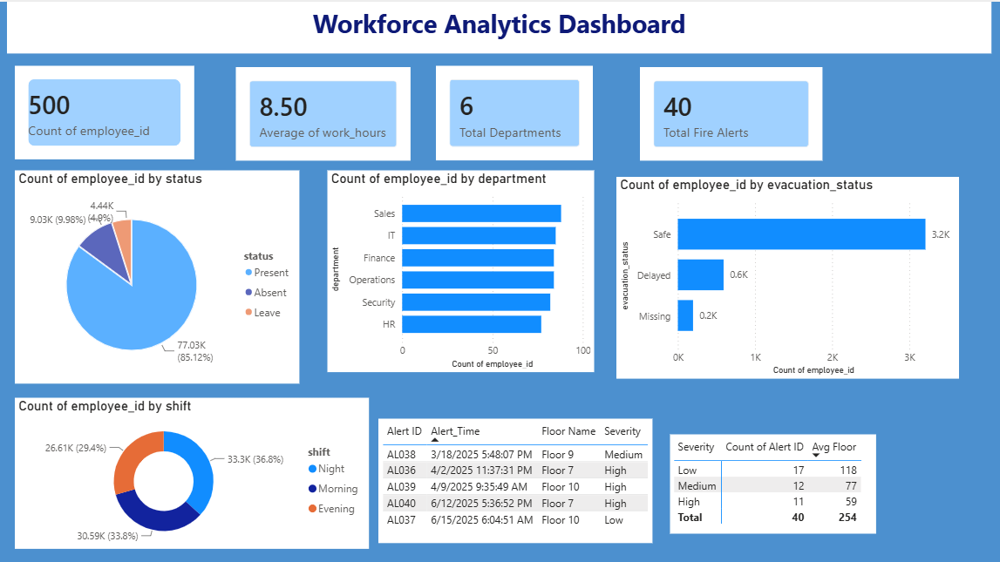

 Workforce Safety & Attendance Dashboard



## Overview

SafeShift Analytics is a workforce monitoring and safety analytics project built using SQL, SQLite, Python, and Power BI. The project tracks employee attendance, work hours, department-wise workforce distribution, fire emergency alerts, evacuation records, and SMS emergency notifications.

This project demonstrates a complete end-to-end data analytics workflow including:

- Data Generation using Python
- Database Management using SQLite
- SQL Query Analysis
- Data Cleaning & Modeling
- Interactive Dashboard Development in Power BI
- Business KPI Tracking

---

# Project Objectives

The primary goal of this project is to analyze workforce operations and emergency safety processes through data-driven insights.

The dashboard helps monitor:

- Employee attendance patterns
- Average work hours
- Shift distribution
- Department-wise absenteeism
- Fire alert activity
- Evacuation response status
- Emergency SMS delivery tracking

---

# Dashboard Preview

## Workforce Analytics Dashboard


---

# Key Features

## Employee Attendance Analytics
- Present vs Absent vs Leave analysis
- Average work hours tracking
- Late employee monitoring
- Shift-wise workforce analysis

## Workforce Safety Analytics
- Fire alert tracking
- Emergency evacuation analysis
- Evacuation status monitoring
- SMS delivery status analysis

## Interactive Dashboard Features
- KPI cards
- Pie charts
- Bar charts
- Line charts
- Department filters
- Shift filters
- Severity filters

---

# Tech Stack

| Technology | Purpose |
|---|---|
| Python | Data generation |
| Pandas | Data processing |
| SQLite | Database management |
| SQL | Data querying and analysis |
| Power BI | Dashboard visualization |

---

# Database Structure

The project uses multiple relational datasets:

| Table | Description |
|---|---|
| employees | Employee master data |
| attendance_logs | Attendance records |
| fire_alerts | Fire emergency alerts |
| evacuation_logs | Employee evacuation records |
| sms_logs | Emergency SMS notifications |

---

# SQL Analytics Performed

The project includes multiple SQL queries for:

- Attendance analysis
- Department-wise employee count
- Average work hours analysis
- Shift distribution analysis
- Fire alert severity analysis
- Evacuation monitoring
- Emergency communication tracking

---

# KPIs Tracked

## Workforce KPIs
- Total Employees
- Attendance Rate
- Average Work Hours
- Late Employees
- Department Distribution

## Safety KPIs
- Total Fire Alerts
- Evacuation Count
- SMS Delivery Success Rate
- Fire Severity Distribution

---

# Dashboard Insights

- Majority employees are marked present across operational shifts.
- Average employee work hours remain around standard business working hours.
- Night shift contains significant workforce allocation.
- High severity fire alerts require faster evacuation response.
- Department-wise absenteeism helps identify operational inefficiencies.

---

# Skills Demonstrated

This project demonstrates:

- Data Cleaning
- Relational Database Design
- SQL Query Writing
- Data Modeling
- Business Intelligence
- KPI Development
- Dashboard Design
- Data Visualization
- Workforce Analytics

---

# Project Folder Structure

```text
safeshift-analytics/
│
├── attendance_logs.xlsx
├── employees.xlsx
├── evacuation_logs.xlsx
├── fire_alerts.xlsx
├── sms_logs.xlsx
│
├── company_operations.db
│
├── workforce_dashboard.pbix
│
├── queries.sql
│
├── dashboard.png
│
└── README.md
```

---

# Future Improvements

Potential future enhancements:

- Real-time emergency alert integration
- Predictive absenteeism analysis
- Machine learning-based anomaly detection
- Live workforce tracking
- Automated notification systems

---

# Author

Kashish
